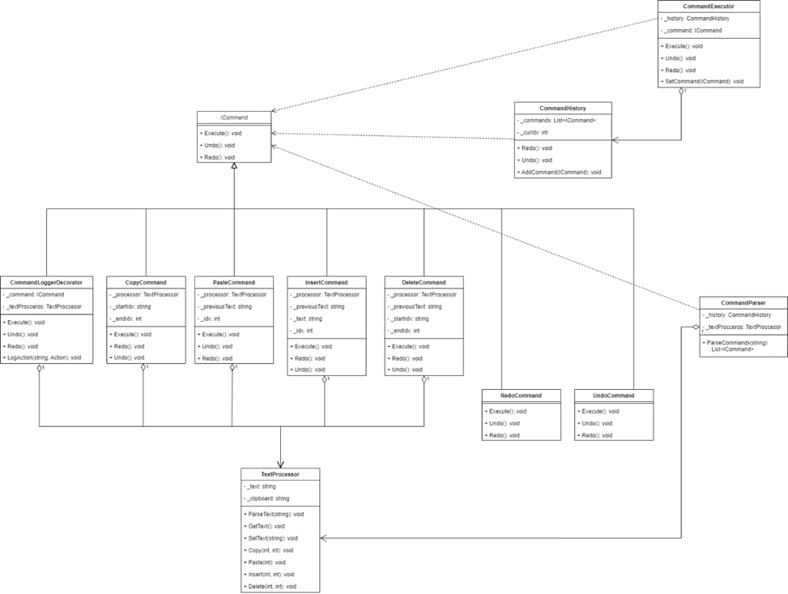
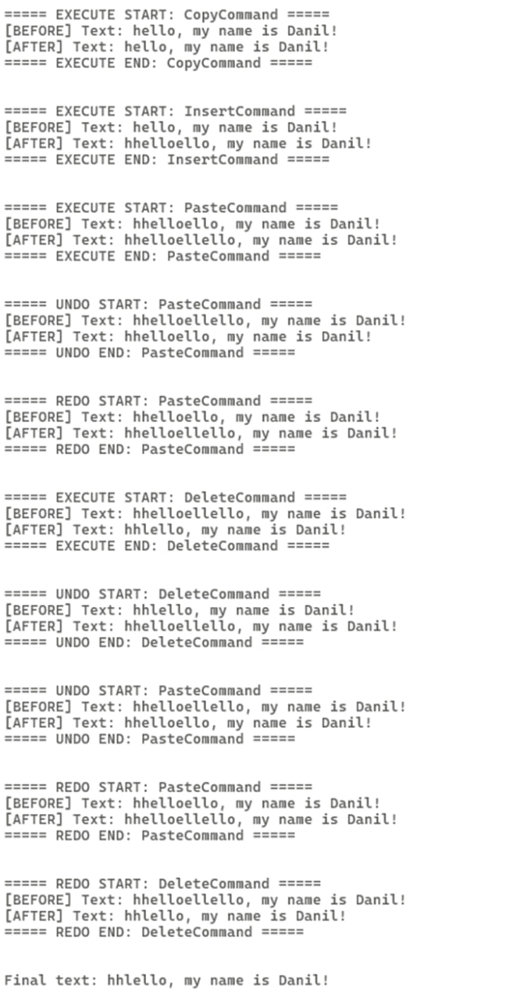

# Текстовый редактор с использованием паттерна "Команда" и "Декоратор"

* [О проекте](#AboutProject)
* [О паттернах](#AboutPatterns)
	* [Паттерн "Команда"](#CommandPattern)
	* [Паттерн "Декоратор"](#DecoratorPattern)
* [Проектирование](#DiagramClass)
* [Итоги и вывод](#EndProject)

## О проекте

Цель проекта — реализовать текстовый редактор, способный выполнять операции над одной строкой с использованием шаблона проектирования "Команда".  
Текстовый редактор работает с двумя файлами:
1. Первый файл содержит строку, над которой выполняются операции.
2. Второй файл — последовательность команд, которые нужно выполнить.

### Поддерживаемые команды:

1. **copy idx1 idx2** — скопировать в буфер обмена символы с позиции `idx1` до `idx2`.
2. **paste idx** — вставить содержимое буфера обмена в позицию `idx`.
3. **insert "string" idx** — вставить строку `"string"` в позицию `idx`.
4. **delete idx1 idx2** — удалить символы с позиции `idx1` до `idx2`.
5. **undo** — отменить последнюю выполненную команду.
6. **redo** — повторить отменённую команду.

### Пример текстового файла команд:

- `copy 1 3` — скопировать символы со 2-го по 4-й (включительно) в буфер обмена.  
- `insert "hello" 1` — вставить строку "hello" в позицию после первого символа.  
- `paste 6` — вставить содержимое буфера обмена после 6-го символа.  
- `undo` — отменить последнюю выполненную операцию.  
- `redo` — повторить отменённую операцию.  
- `delete 2 7` — удалить символы со 2-го по 7-й.  
- `undo` — отменить последнюю выполненную операцию.  

### Примечания:
- Аргументы `idx1`, `idx2`, и `idx` — это индексы строки, начиная с нуля.
- Все команды выполняются последовательно.

## О паттернах

## Паттерн "Команда"

Паттерн «Команда» (Command) — это поведенческий паттерн проектирования, который инкапсулирует запрос в виде объекта. Этот объект, называемый «команда», содержит всю необходимую информацию для выполнения определенной операции. Такой подход позволяет отделить объект, который инициирует запрос, от объекта, который его выполняет. Ключевое преимущество паттерна — возможность выполнения операций асинхронно, отложено или в любой другой удобный момент. Данный паттерн следует применять в следующих случаях: 
• Отложенное выполнение: нужно запланировать выполнение операции позже.
• Обработка очереди запросов: необходимо обработать несколько запросов в определенном порядке.
• Отмена и восстановление действий (Undo/Redo): необходимо поддерживать историю изменений и возможность отменить или восстановить предыдущие операции.
• Логирование: нужно записывать информацию о выполненных операциях.
• Упрощение интерфейса: необходимо предоставить простой интерфейс для вызова сложных операций.

## Паттерн "Декоратор"

Паттерн «Декоратор» (Decorator) структурный и предназначен для динамического расширения функциональности объектов. 
Он позволяет добавлять новые поведения объектам без изменения их кода. 
В контексте текстового редактора "Декоратор" может использоваться для добавления логирования или других вспомогательных функций, не затрагивая основную логику работы.

## Проектирование

### Диаграмма классов:

## Итоги и вывод

привет
